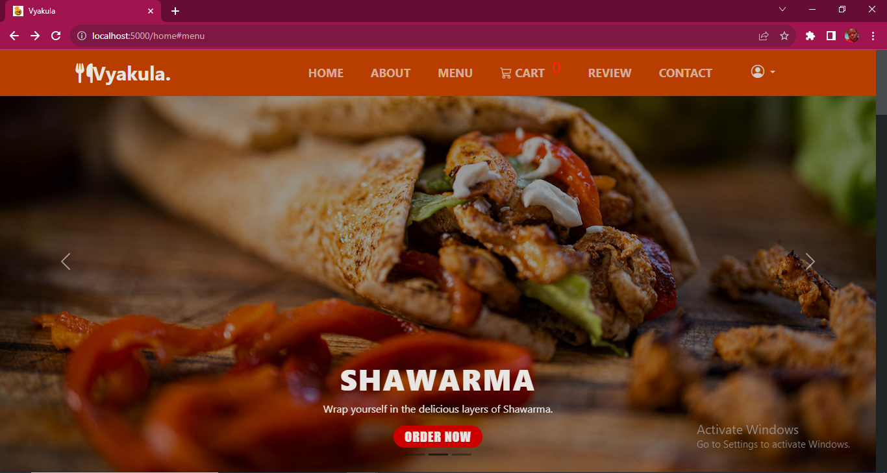
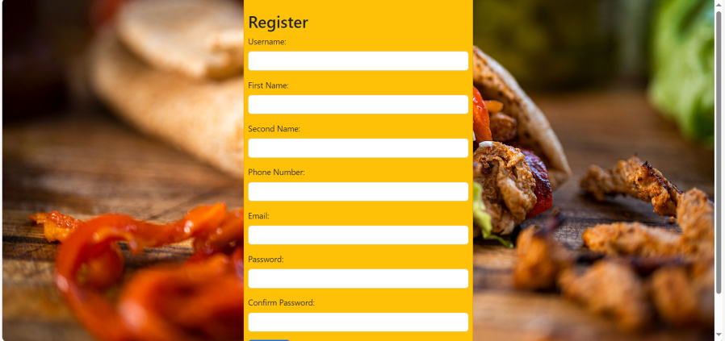
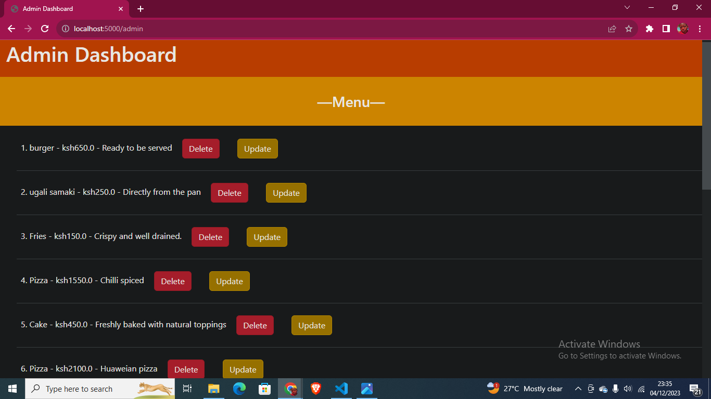
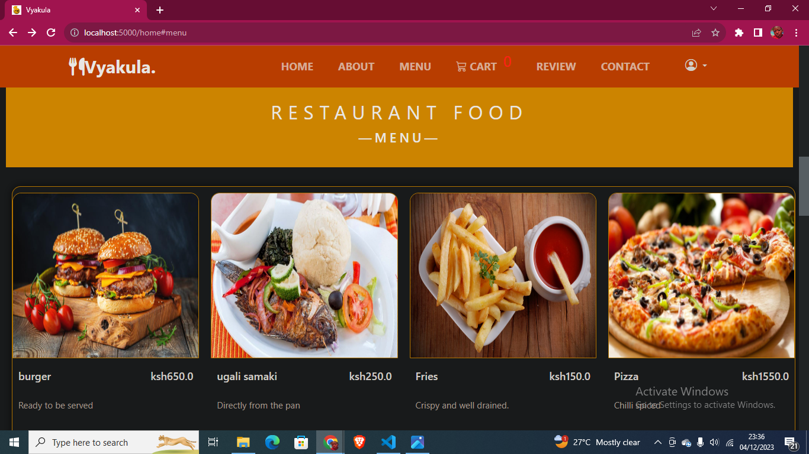

<h2> Vyakula (Food Delivery Website) </h2>

 
<h3> Description </h3>

<b>The project is named Vyakula</b> - Vyakula is a Swahili word that can be translated to English as Cuisine. The idea was inspired from a customer centric approach to create an experience centered around their preferences. To provide rich tapestry of local cuisines, we aimed to celebrate diversity through our menu.  We understand the joy of savoring exquisite dishes without leaving the comfort of your home. Our platform is a haven for food enthusiasts, offering a seamless and delightful food delivery experience. We noticed a lack of online platforms specifically dedicated to African cuisine, this have since been a driving force to create something unique and valuable to cater for our peoples' needs. 

## Table of Contents

1. [Installation](#installation)
2. [Usage](#usage)
3. [Features](#features)
4. [Contributing](#contributing)
5. [Contributors](#contributors)
6. [License](#license)

## Installation
1. Clone the repository
2. Navigate the project directory
3. Run `pip install -r requirements.txt` to install the dependencies

## Usage
1. Run `flask run` to start the application
2. Open your browser and type `http://localhost:5000`

## Features
1. User can register
    
2. User can login
    
3. Admins can add, update and delete menu
    
4. User can browse the menu
    

## Contributing
We welcome contributions! Please follow these guidelines:
1. Fork the repository
2. Create a new branch
3. Make your changes
4. Submit a pull request

## Contributors
1. Brian Jalang'o      - brianhannington94@gmail.com
2. Duncan Musau        - kokidanny15@gmail.com
3. Syphrose Wabulwenyi - swabulwenyi@gmail.com

## License
This project is licensed under the [MIT License](LICENSE)